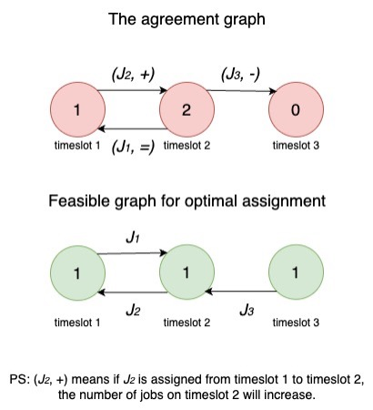
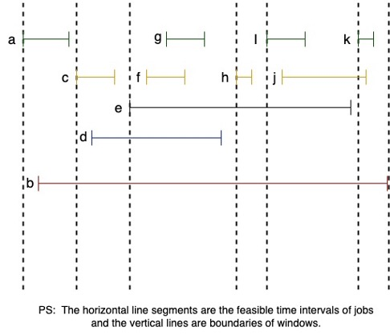
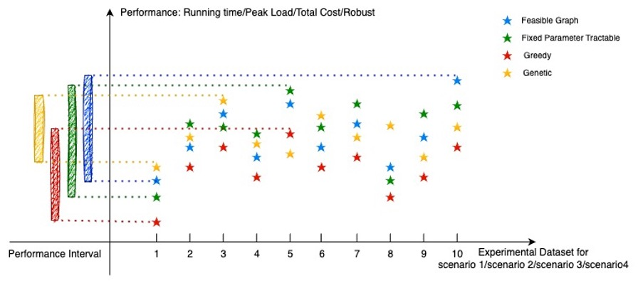

# Scheduling for Smart Grid
>Authored by: @[Martingale](https://github.com/MartinRepo)

Click [here](https://demo-smartgrid.tech) to visit demo site. Just try it :)
## Content
- [Algorithms Implementation](#algorithms-implementation)
  - [Feasible Graph](#feasible-graph)
  - [Fixed Parameter Tractable](#fixed-parameter-tractable)
  - [Greedy](#greedy)
  - [Genetic](#genetic)
- [Dataset Preview](#dataset-preview)
- [Simulation](#simulation)
- [Performance Comparison](#performance-comparison)
  - [Total cost](#total-cost)
  - [Peak cost](#peak-cost)
  - [Running time](#running-time)

## Algorithms Implementation

### Feasible Graph
  
### Fixed Parameter Tractable
### Greedy
### Genetic

## Dataset Preview
There are 11 jobs, 6 windows, 7 boundaries.Their width(duration) and height(power cost) is adjusted

## Simulation

## Performance Comparison
### Total cost
### Peak cost
### Running time

